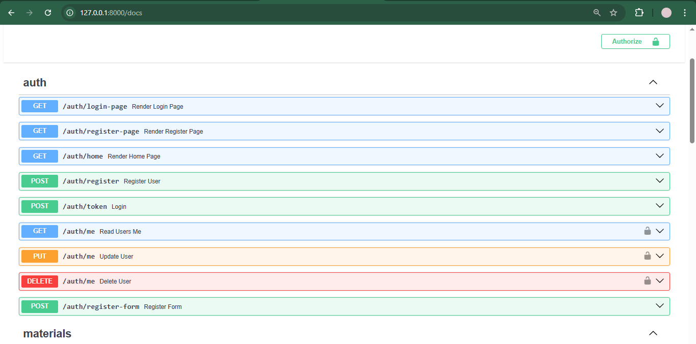
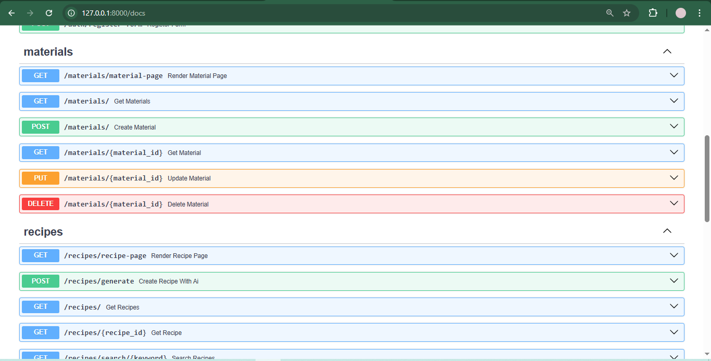
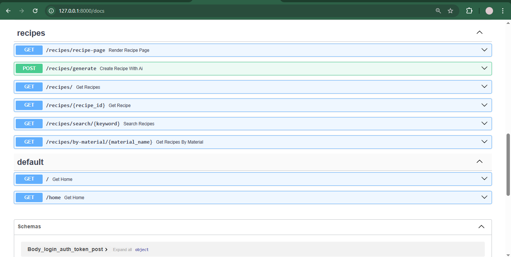
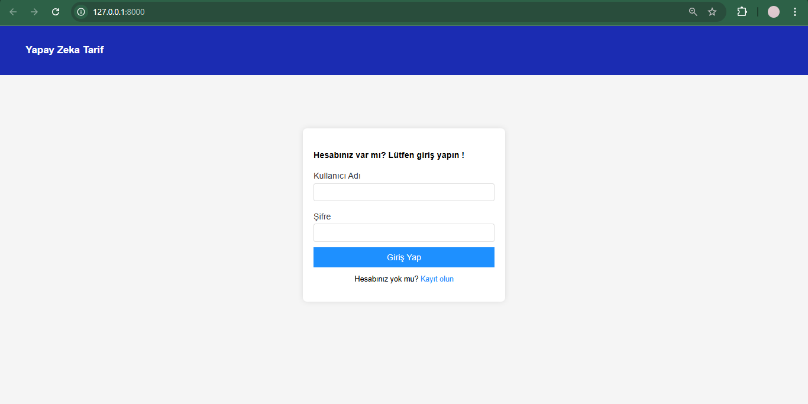
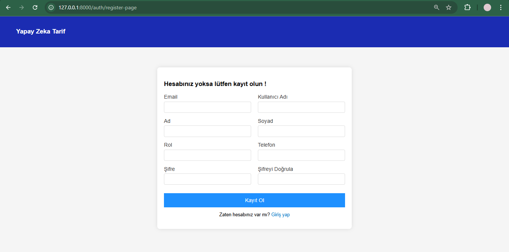
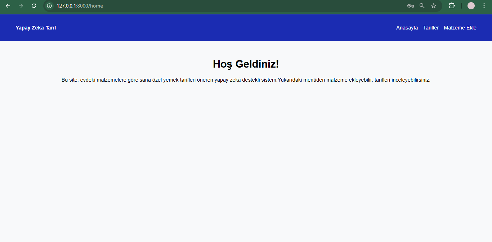
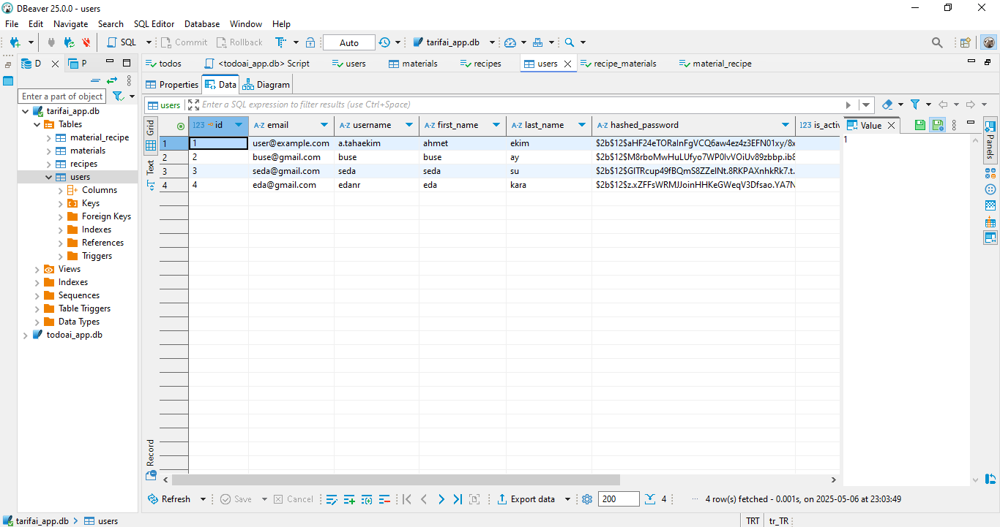

Projenin amacı: Evde olan malzemeleri değerlendirmek, gıda israfını önlemek ve yemek yapma sıkıntısını ortadan kaldırmak amaçlanmıştır. İsrafı önleyerek sürdürülebilirlik faaliyetlerine katkı sağlamak hedeflenmektedir.

Projenin ekran görüntüleri:

